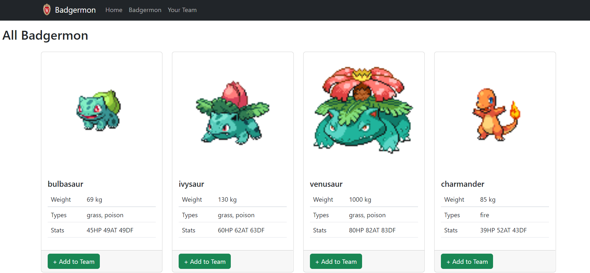
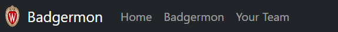
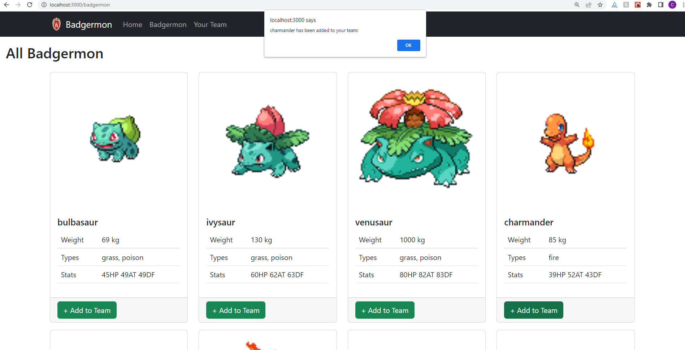
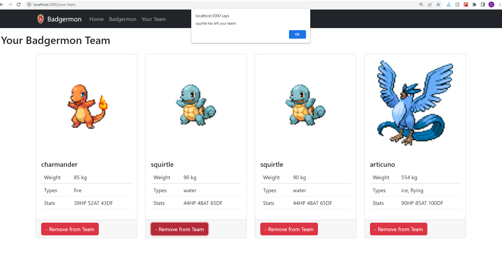
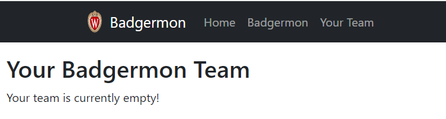

# CS571 Week 04: Badgermon

```c
#define badgermon pokemon
```

Welcome to Badgermon! For this assignment, you will complete a web application that allows trainers to recruit their very own Badgermon! Following, you will answer questions related to web design.  **Make sure to complete both parts of this assignment.**



## Badgermon

The starter code provided to you was generated using [create-react-app](https://www.npmjs.com/package/create-react-app). Furthermore, [bootstrap](https://www.npmjs.com/package/bootstrap), [react-bootstrap](https://www.npmjs.com/package/react-bootstrap), and [react-router](https://reactrouter.com/en/main) have already been installed. **You should *not* re-run the create-react-app command**. Instead, in this directory, simply run...

```bash
npm install
npm start
```

Then, in a browser, open `localhost:3000`. You should *not* open index.html in a browser; React works differently than traditional web programming! When you save your changes, they appear in the browser automatically. I recommend using [Visual Studio Code](https://code.visualstudio.com/) to do your development work.

The components you will be working on are located in the `components` folder. Some code (such as `Badgermon.js`) has already been done for you, but there is still much work to do.

The Badgermon application will display all 151 Gen I "Badgermon" (scraped from [PokeAPI](https://pokeapi.co/)) to the user. The user will then be able to manage their own team of Badgermon, adding and removing Badgermon as necessary.

All data can be retrieved via API calls to `https://www.coletnelson.us/cs571/f22/hw4/api/badgermon`. You do *not* need to make API calls to PokeAPI directly. The API endpoint will return an array of all 151 Badgermon: their `id`, `name`, `weight` (in kg), `img`, `stats` (`hp`, `attack`, and `defense`) and `types`.

### 1. Complete Routing

In `App.js`, complete the routing table using [react-router](https://reactrouter.com/en/main) so that...
 - `/` brings you to the `Home` component (completed for you!)
 - `/badgermon` brings you to the `AllBadgermonList` component
 - `/your-team` brings you to the `YourBadgermonTeam` component
 - any other route brings you to the `NoMatch` component



### 2. `fetch` Badgermon
In `Layout.js`, when the component is rendered, [make a fetch to the Badgermon API](https://www.coletnelson.us/cs571/f22/hw4/api/badgermon) and store the result in the state variable `badgermon`.

**FYI:** Notice that `AllBadgermonDataContext` and `BadgermonTeamContext` wrap the `Outlet` component. These context providers provide downstream components with access to this shared data. You just completed the work for `AllBadgermonDataContext`; this context holds an array of *all* 151 Badgermon. In future steps, you will maintain `BadgermonTeamContext`; adding and removing Badgermon as the trainer makes their recruitment decisions.

### 3. Display Badgermon

In `AllBadgermonList.js`, using the data from the context that you just populated, display all of the Badgermon to the webpage. This will be very similar to what we did in HW3. For reactivity, use [bootstrap](https://react-bootstrap.github.io/) so that the following is shown...
 - 1 column of cards on `xs` devices
 - 2 columns of cards on `md` devices
 - 3 columns of cards on `lg` devices
 - 4 columns of cards on `xl` devices

To display each card, we will use a re-usable, card-like component called `Badgermon`. Luckily, `Badgermon.js` has already been completed for you! It takes 4 props.
 - `badgermon`: The object with the `id`, `weight`, `stats`, etc. from the API.
 - `buttonText`: The text to display on the button.
 - `buttonVariant`: The [bootstrap color variant](https://react-bootstrap.github.io/components/buttons/) to be used.
 - `buttonAction`: A callback that will be called when the button is clicked. This callback will recieve the selected Badgermon object with an appended UUID.

For each Badgermon, display a `Badgermon` component. You can use the badgermon's `id` as its unique key. Each `Badgermon` component should display the Badgermon's information and a green button that says "+ Add to Team". When the button is clicked, it should alert the user that the "{pokemonName} has been added to your team!" 

The next step will refine this action.



### 4. Form a Team

Rather than just alerting the user, the button should also add the Badgermon to the end of the `BadgermonTeamContext`. Use `setTeam` to mutate the context -- do not change it directly!

**Note:** When you add a Badgermon to your team, it does not remove them from the overall list! There are plenty of rattatas in this world!

### 5. Manage a Team

In `YourBadgermonTeam.js`, similar to what you did in `AllBadgermonList.js`, display each of the Badgermon *on your team*. Each `Badgermon` component should display the Badgermon's information and a red button that says "- Remove from Team". When the button is clicked, it should alert the user that the "{pokemonName} has left your team!" and immediately remove that Badgermon from the team. If there are duplicate Badgermon, only the specified Badgermon should be removed.

Notice that, because there can be duplicate Badgermon on your team, you can no longer use the Badgermon's `id` as a key! Instead, use the newly appended `uuid` as a key.

You will need to use the `BadgermonTeamContext` to do this. Again, use `setTeam` to mutate the context -- do not change it directly!



### 6. Badgermonless Team

Finally, as a courtesy to the user, if there are no Badgermon on their team, display a message that says "Your team is currently empty!"




## Web Design
The questions below will ask you about the design of the Badgermon website that you had just implemented. For each question, please write a 2-5 sentence response grounded in content from the "Web Design" lecture or other reputable sources.

1. Thinking back to the lecture, we discussed many patterns and tools used by websites. What kinds of patterns and tools could be added to enhance the user's experience?

INSERT YOUR RESPONSE HERE.

2. Consider "the fold". What effect could this have on users selecting their Badgermon team, if any?

INSERT YOUR RESPONSE HERE.

3. For this assignment, on page load, we immediately added all 151 Badgermon to the `AllBadgermonList` component. However, this could have serious impacts on performance and user experience. What could be done in this situation?

INSERT YOUR RESPONSE HERE.
